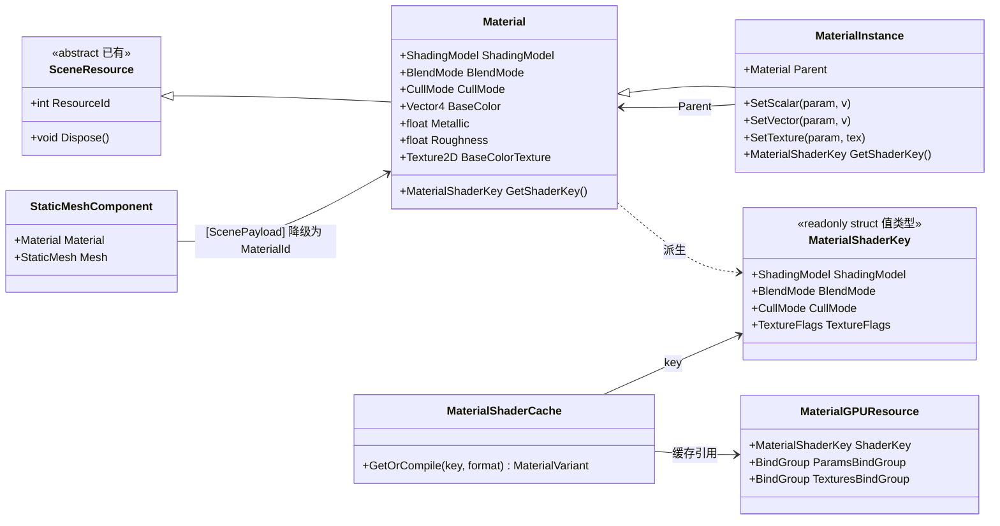

# Spark.Engine 材质系统设计

> 状态：P0~P3 已实现（本文记录设计；P4 节点图待实现）。法线贴图（§9）已随 P2 落地，PBR 仍待实现。
> 对应 [README](./README.md) 二、P2-5「材质系统 + 纹理采样 + 实际光照着色」。
> 决策记录：见 §12（ADR-13~20）；UE 对比：见 §13；未决事项：见 §14。
> 关联代码：`Src/Spark.Engine/Render/Resources/Material.cs`、`MaterialGPUResource.cs`、`ResourceManager.cs`、
> `Src/Spark.Engine/Render/Pipeline/Forward/ForwardRenderer.cs`、`MaterialShaderCodegen.cs`、`MaterialShaderCache.cs`、
> `Src/Spark.Engine/Render/Pipeline/IRenderPipeline.cs`、`Src/Spark.Engine/Components/StaticMeshComponent.cs`、
> `Src/Spark.Engine.SceneGen/SceneProxyGenerator.cs`。

## 1. 背景与目标

当前渲染已经能画出静态网格：`SceneRenderer` 里内嵌一段**写死的 WGSL**（`ShaderCode`，仅做
`textureSample(tex, samp, uv) * vertexColor`），一个 `RenderPipeline`、一个 `PipelineLayout`
（group0=每实例 MVP uniform，group1=纹理+采样器），`StaticMeshComponent` 上挂的是
`Texture`（资源）+ `MaterialId`（int 占位）。光源数据通路已就绪（`LightPayload` 进快照、已剔除、
`SceneRenderer._visibleLights` 已收集），但**没有任何实际着色**；纹理、材质、光照 shader 全未实现。

"UE 式材质系统"在本引擎里的本质是：**把「一份写死 shader」换成「shader = f(材质)，编译后缓存 +
每实例参数绑定」**；节点图编辑器只是这层编译管线之上的一个 UI。

本设计要解决四个核心问题：

1. **材质缺失**：网格只有一个 `MaterialId` 占位 + 一个裸纹理，无法表达"一类着色 + 一组参数"。
2. **shader 写死**：所有网格共用同一份 WGSL 与同一个 pipeline，无法按材质切换着色模型/混合模式/双面。
3. **着色缺失**：光源参数已到渲染线程，但没有光照计算，Lit 材质无从谈起。
4. **可扩展性**：没有 shader 变体（permutation）概念，未来节点图、后处理材质、阴影都无法挂载。

目标架构：**材质成为一等公民资源**（`Material` / `MaterialInstance`，走现有 `SceneResource` /
`ResourceManager` 上传通道），**静态属性决定 shader 变体、实例只覆写参数**（UE 的性能模型核心），
**按更新频率把绑定组拆成四层**，用**模板 + 开关生成 WGSL** 先打通渲染与着色，节点图编辑器作为
后续大阶段（P4）单独立项。

## 2. 设计原则（在 P1~P11 上新增）

- **P12 shader 编译产物缓存**：材质的静态属性（着色模型/混合模式/双面/纹理开关）折叠为一个
  `MaterialShaderKey`，编译产物（ShaderModule + RenderPipeline）按 key 缓存、跨材质资产共享；
  材质实例只传参数，不产生新 shader。
- **P13 静态与动态分离**：`Material` 决定"编译出什么 shader"（静态，编译期），`MaterialInstance`
  只决定"参数取什么值"（动态，每实例）。这是 UE `UMaterial` / `UMaterialInstance` 性能模型的直接映射。
- **P14 材质也是场景资源**：`Material`/`MaterialInstance` 实现 `ISceneResource`，走 `ResourceManager`
  upload-once + ADR-7 延迟释放；组件经 `[ScenePayload]` 资源成员降级自动上传（与 `Mesh`/`Texture` 同套路）。
- **P15 绑定组按更新频率分层**：frame / object / material-params / material-textures 四组，
  每组一个稳定 ID，组布局全局唯一（§6），只有 shader 代码与 pipeline 随 key 变。
- **P16 结构化参数先行、节点图后置**：先用"固定参数集 + WGSL 模板占位"打通编译与着色（P0~P3），
  `MaterialExpression` 节点图与任意节点 codegen 留到 P4。

## 3. 总体架构与数据流

```
┌──────────────────── 逻辑线程 ─────────────────────────────┐
│  Material（静态属性 + 默认参数，: SceneResource）          │
│  MaterialInstance（parent + 参数覆写，: Material）        │
│        │ 组件 StaticMeshComponent.Material（[ScenePayload] │
│        │   资源成员 → 生成器降级为 MaterialId + 自动上传） │
│        ▼                                                  │
│  SceneSnapshot.StaticMeshes[].MaterialId（值快照）        │
└──────────────┼───────────────────────────────────────────┘
               ▼  DualFrameBuffer<SceneSnapshot>（双缓冲）
┌──────────────┴───────────────────────────────────────────┐
│  ForwardRenderer : IRenderPipeline（渲染线程）            │
│    ├─ ProcessUploads：case Material/MaterialInstance       │
│    │     → 解析有效参数 → 算 MaterialShaderKey            │
│    │     → MaterialShaderCache 取/编译变体（缓存共享）     │
│    │     → 建 MaterialGPUResource（group2 params + group3 纹理）│
│    ├─ SyncProxyStates / Cull（已有，不变）                 │
│    └─ DrawStaticMesh：按 MaterialId 取 pipeline → set 4 组 │
│         bind group → draw                                │
└───────────────────────────────────────────────────────────┘
```

依赖拓扑（实施顺序）：

```
A. Material/MaterialInstance 数据模型 + 参数覆写解析（纯函数，无 GPU）   ← P0
   ↓
B. MaterialShaderKey + WGSL 模板 codegen + MaterialShaderCache           ← P1
   ↓
C. 绑定组四层重构 + ForwardRenderer.DrawStaticMesh 改造（替换硬编码 shader）← P1
   ↓
D. 光源 uniform buffer + Lit/Blinn-Phong 着色（消费 _visibleLights）     ← P2
   ↓
E. MaterialInstance 参数脏标记 + 每实例参数/纹理覆写上传                 ← P3
   ↓
F. MaterialExpression 节点图 + 任意图 codegen + 编辑器 UI（大阶段）      ← P4
```

### 3.1 核心类图（资产与编译缓存）



## 4. 数据模型

### 4.1 枚举与参数集

```csharp
public enum ShadingModel : byte { Unlit = 0, Lit = 1 /* Blinn-Phong，PBR 见 §14 */, PBR = 2 }
public enum BlendMode   : byte { Opaque = 0, Masked = 1, Translucent = 2 }
public enum CullMode    : byte { Back = 0, None = 1 }   // None = 双面

public enum MaterialParam : byte
{
    BaseColor = 0, Metallic = 1, Roughness = 2,
    EmissiveColor = 3, EmissiveStrength = 4, Opacity = 5, NormalStrength = 6,
    // 纹理槽位（固定 5 槽，见 §6）
    BaseColorTexture = 100, NormalTexture = 101, EmissiveTexture = 102,
    MetallicRoughnessTexture = 103, MaskTexture = 104,
}
```

v1 采用**固定参数集**（一个 struct + 一个固定 uniform 布局），而非开放字典——GPU 布局可预测、
组布局全局唯一（§6）。开放参数字典（任意命名参数）留待 P4 节点图阶段。

### 4.2 Material（定义 shader + 默认参数）

```csharp
public class Material : SceneResource
{
    public ShadingModel ShadingModel { get; set; } = ShadingModel.Lit;
    public BlendMode   BlendMode   { get; set; } = BlendMode.Opaque;
    public CullMode    CullMode    { get; set; } = CullMode.Back;

    // 默认参数（实例未覆写时生效）
    public Vector4 BaseColor      { get; set; } = Vector4.One;
    public float   Metallic       { get; set; }
    public float   Roughness      { get; set; } = 0.5f;
    public Vector4 EmissiveColor  { get; set; } = Vector4.Zero;
    public float   EmissiveStrength { get; set; }
    public float   Opacity        { get; set; } = 1f;
    public float   NormalStrength { get; set; } = 1f;

    // 纹理参数（资源成员；null = 该槽位用 fallback 纹理，见 §6）
    public Texture2D? BaseColorTexture { get; set; }
    public Texture2D? NormalTexture { get; set; }
    public Texture2D? EmissiveTexture { get; set; }
    public Texture2D? MetallicRoughnessTexture { get; set; }
    public Texture2D? MaskTexture { get; set; }

    public MaterialShaderKey GetShaderKey();   // 由上述静态属性折叠（纯函数）
    public MaterialParamsUniform GetParamsUniform();  // 默认参数 → 固定 uniform 布局（纯函数）
}
```

### 4.3 MaterialInstance（引用父材质 + 参数覆写）

```csharp
public class MaterialInstance : Material
{
    public Material? Parent { get; set; }

    // 覆写表（只存被改动的槽；未覆写继承 parent 默认）
    private readonly Dictionary<MaterialParam, float>  _scalars = new();
    private readonly Dictionary<MaterialParam, Vector4> _vectors = new();
    private readonly Dictionary<MaterialParam, Texture2D> _textures = new();

    public void SetScalar(MaterialParam p, float v);
    public void SetVector(MaterialParam p, Vector4 v);
    public void SetTexture(MaterialParam p, Texture2D? t);

    // 有效值 = parent 链默认 ⊕ 本实例覆写（纯函数，可单测）
    public override MaterialShaderKey GetShaderKey() => Parent?.GetShaderKey() ?? base.GetShaderKey();
    public override MaterialParamsUniform GetParamsUniform();  // 沿 parent 链解析
}
```

要点：

- **`MaterialInstance` 派生自 `Material`**：组件 `[ScenePayload]` 成员类型统一为 `Material?`
  （可挂基础材质或实例），SceneProxy 源生成器按 `ISceneResource` 匹配降级为 `MaterialId`；
  渲染线程按 `MaterialId` 在 `_gpuResources` 里查到的是**同一个 `MaterialGPUResource`**（其内部
  按有效 shader key + 有效参数生成），无需区分资产类型。v1 不引入独立 `IMaterial` 接口（UE 的
  `UMaterialInterface`），避免让生成器的接口名匹配失效，留待 P4 再评估。
- **shader 只由 parent 决定**：实例不改变 shader 变体，`GetShaderKey()` 委托给 parent；实例的
  `ShadingModel/BlendMode/...` 等静态属性被覆写表忽略（或断言未使用）。
- **参数解析是纯函数**：`GetParamsUniform()` 沿 parent 链合并，输出固定 `MaterialParamsUniform`，
  便于单元测试与缓存失效判断。

## 5. Shader Key 与变体（permutation）

```csharp
public readonly struct MaterialShaderKey : IEquatable<MaterialShaderKey>
{
    public readonly ShadingModel ShadingModel;   // Unlit / Lit / PBR
    public readonly BlendMode   BlendMode;       // Opaque / Masked / Translucent
    public readonly CullMode    CullMode;        // Back / None
    public readonly TextureFlags TextureFlags;   // 五位：有无各纹理（只改 shader 代码，不改绑定布局）
}

[Flags] public enum TextureFlags : byte
{
    None = 0,
    BaseColor = 1, Normal = 2, Emissive = 4, MetallicRoughness = 8, Mask = 16,
}
```

- **`(MaterialShaderKey, ShaderPass) → MaterialVariant`**（编译缓存，跨材质资产 + 跨 pass 共享）：
  同一材质按 pass 编出多份 shader（Forward / ShadowDepth / DepthOnly），静态属性相同的材质复用同一
  编译产物（每个 (key, pass, target format) 一个 pipeline，见 §7.1）。
- **纹理开关只改生成代码、不改绑定布局**：五个纹理槽位**恒绑定**（无纹理用 fallback 纹理，§6），
  `TextureFlags` 只决定生成 WGSL 是否 `textureSample` 该槽并参与混合——绑定组布局全局唯一，缓存
  管理大幅简化（见 §6 与 ADR-15）。
- `BlendMode.Masked` 隐含 alpha test（`clip`），并影响 pipeline 的 blend/alpha-to-coverage 状态；
  `BlendMode.Translucent` 开启 alpha 混合（pipeline `BlendState`）。

## 6. 绑定组约定（四层）

对现有两组（group0=MVP，group1=纹理+采样器）做重构，按更新频率拆为四组；**四组的 layout 全局唯一，
只建一次**：

| group | 内容 | 绑定 | 更新频率 / set 时机 |
|---|---|---|---|
| 0 PerFrame | ViewProjection、相机位置、光源 buffer（P2） | binding 0/1/2 | 每相机/每 pass set 一次 |
| 1 PerObject | World 矩阵、法线矩阵（3x3） | binding 0/1 | 每实例（ProxyId 状态，对应现有 MVP uniform 改造） |
| 2 MaterialParams | 固定 `MaterialParamsUniform`（tint/metallic/roughness/emissive/opacity…） | binding 0 | 每材质资产 set 一次 |
| 3 MaterialTextures | 5 个固定纹理槽 + 共享采样器 | binding 0..5 | 每材质资产 set 一次 |

- **group3 固定 5 槽 + fallback 纹理**：无纹理的槽绑 1x1 白/黑/法线 fallback 纹理，布局不因材质而异，
  `TextureFlags` 只切 shader 代码（ADR-15）。
- **group2 固定 uniform 布局**：`MaterialParamsUniform` 是 blittable struct，C# 与 WGSL 两侧
  字段一一对应，每材质资产一个 buffer（实例参数覆写后重新 `QueueWriteBuffer`）。
- 现有 per-instance `StaticMeshRenderState`（group1 的 MVP）改造为"world + 法线矩阵"，view-proj
  下沉到 group0，为多材质/多光源共享同一相机矩阵铺路。

## 7. WGSL 代码生成（模板 + 开关）

P1 用**模板 + 占位替换**生成 WGSL，P4 再换节点图 codegen。占位按 `MaterialShaderKey` 填入，着色片段按 `ShaderPass` 分支：

```wgsl
struct VertexInput {
    @location(0) position : vec3f,
    @location(1) color   : vec3f,
    @location(2) uv      : vec2f,
};
struct VertexOutput {
    @builtin(position) clip_position : vec4f,
    @location(0) world_pos   : vec3f,
    @location(1) world_normal: vec3f,
    @location(2) uv          : vec2f,
    @location(3) color       : vec3f,
};

@group(0) @binding(0) var<uniform> frame : FrameUniforms;      // viewProj + cameraPos
@group(1) @binding(0) var<uniform> obj : ObjectUniforms;       // world + normalMat
@group(2) @binding(0) var<uniform> mp : MaterialParamsUniform;
@group(3) @binding(0) var baseColorTex : texture_2d<f32>;
@group(3) @binding(1) var normalTex    : texture_2d<f32>;
@group(3) @binding(2) var emissiveTex  : texture_2d<f32>;
@group(3) @binding(3) var mrTex        : texture_2d<f32>;
@group(3) @binding(4) var maskTex      : texture_2d<f32>;
@group(3) @binding(5) var samp         : sampler;

@vertex
fn vs_main(in : VertexInput) -> VertexOutput { /* world = obj.world * vec4(in.position,1); normal = obj.normalMat * in.normal; ... */ }

@fragment
fn fs_main(in : VertexOutput) -> @location(0) vec4f {
    var c = mp.baseColor;                       // tint 起点
    // @@HAS_BASE_COLOR_TEXTURE@@ c *= textureSample(baseColorTex, samp, in.uv);
    // @@SHADING_MODEL==LIT@@  c = ShadeLit(c, mp, in, frame.cameraPos);
    // @@SHADING_MODEL==PBR@@  c = ShadePbr(c, mp, in, frame.cameraPos);
    // @@HAS_EMISSIVE_TEXTURE@@ c += textureSample(emissiveTex, samp, in.uv) * mp.emissiveStrength;
    // @@BLEND_MODE==MASKED@@   if (c.a < mp.opacity) { discard; }
    return c;
}
```

代码生成器（`MaterialShaderCodegen`）是一个纯函数：`string Generate(MaterialShaderKey key, ShaderPass pass)`，
便于单测。`ShaderPass.Forward` 拼完整着色（`ShadeLit` 光照函数模板）；`ShadowDepth`/`DepthOnly` 拼
仅写深度的片元（`ForwardDepthFragment.wgsl`，masked 材质按 mask 纹理 `discard`）。

### 7.1 多 pass（ShaderPass）

同一材质在不同渲染阶段需要不同 shader——UE 的 `FMaterialShaderMap` 对每个 shader type 各编一份，
这里用 `ShaderPass` 枚举做简化版：

| pass | 片元着色 | pipeline 附件 | 用途 |
|---|---|---|---|
| `Forward` | 完整着色（shade_lit） | 颜色附件 | 前向基础 pass |
| `ShadowDepth` | 仅写深度（masked 时 discard） | 无颜色附件 + 深度附件 | 阴影贴图 |
| `DepthOnly` | 仅写深度（masked 时 discard） | 无颜色附件 + 深度附件 | 深度预 pass |

- 完整 shader 身份 = **`(MaterialShaderKey, ShaderPass)`**：`MaterialShaderKey` 决定"材质是什么"（静态属性），
  `ShaderPass` 决定"在哪个阶段画"；两者正交，缓存按元组隔离（§5，ADR-22）。
- 顶点着色器三个 pass 共用（都输出 clip_position + uv/法线）；片元着色器按 pass 分支，深度 pass 复用
  材质参数里的 mask 开关（`BlendMode.Masked`）决定是否 `discard`。
- 深度 pass 的 pipeline：`FragmentState.TargetCount=0`（无颜色目标）+ `DepthStencilState`
  （`Depth24Plus`，写深度、`CompareFunction.Less`）。
- 渲染器当前只画 `ShaderPass.Forward`；真正跑阴影/深度 pass 还需 `TextureRenderTarget` + 深度缓冲
  + 渲染器多 pass 循环（步骤 B，见 §14）。

## 8. 与现有单通道集成

改动点全部落在已抽象的接缝上，同步机制/身份协议/线程契约/剔除循环**零改动**：

1. **`StaticMeshComponent`**：删除 `Texture`/`MaterialId` 占位，改为
   `[ScenePayload] public Material? Material { get; set; }`。生成器自动降级为 `MaterialId` 进
   `StaticMeshPayload`，并在 `SyncProxy` 里 `ResourceManager.EnsureUploaded(Material)`——与 `Mesh` 完全同套路。
2. **`ResourceManager` / `ForwardRenderer.ProcessUploads`**：新增
   `case Material material: ...`（现有代码已留 `// 未来：case Material material:` 注释）。渲染线程：
   解析有效 shader key → 查/编译变体 → 建 `MaterialGPUResource`（group2 params buffer + group3 纹理
   bind group），入 `_gpuResources[material.ResourceId]`。
3. **`ForwardRenderer.DrawStaticMesh`**：从"写死 `_renderPipeline` + 2 组"改为
   "按 `payload.MaterialId` 取 `MaterialGPUResource` → `SetPipeline(variant.Pipeline)` →
   `SetBindGroup(0..3)` → draw"。未指定材质/未上传时回退引擎内置 DefaultMaterial（ADR-17）。
4. **纹理上传复用**：材质引用的 `Texture2D` 仍各自走 `ProcessUploads` 的 `case Texture2D`；
   材质 GPU 资源只持有其 `TextureGPUResource` 的引用（由 `_gpuResources` 字典管理），不重复上传。

## 9. 光照着色（P2）

- **光源 buffer**：渲染线程每帧把 `_visibleLights`（已剔除，`ForwardRenderer` 已有）打包进 group0 的
  固定容量 uniform/storage buffer（`MAX_LIGHTS` 上限，超限按强度排序截断），随 pass 上传。
- **着色模型**：v1 先实现 `Lit`（Blinn-Phong，点光/平行光/聚光 + 衰减 + 法线/粗糙度），
  `Unlit` 直接返回 albedo；`PBR`（Metallic-Roughness）作为 `MaterialParamsUniform` 已含
  metallic/roughness 的顺延扩展（§14 决策）。
- **法线贴图**（已实现）：有 `NormalTexture` 时（`TextureFlags.Normal` 置位），片元里用屏幕空间导数法
  （`dpdx`/`dpdy` 对世界坐标与 UV 求导）构建 TBN，无需切线顶点属性；采样法线纹理 `*2-1` 还原到 [-1,1]，
  按 `NormalStrength` 缩放 xy 后经 TBN 变换到世界空间，覆盖几何法线传入 `shade_lit`。

## 10. 材质实例化与参数上传（P3）

- **有效参数解析**：`MaterialInstance.GetParamsUniform()` 沿 parent 链合并（纯函数），渲染线程
  建 `MaterialGPUResource` 时算一次；实例参数被 `SetScalar/SetVector/SetTexture` 改动时标记 dirty。
- **dirty 增量上传**：`MaterialInstance` 版本号递增，渲染线程检测版本变化 → 重写 group2 params buffer /
  重绑 group3 纹理；未变则复用（对应 P1-3 dirty 增量快照的既定方向）。
- **纹理覆写**：`SetTexture` 只换 group3 对应槽位的纹理视图，不改 shader key（纹理开关由 parent 决定，
  fallback 纹理兜底）。

## 11. 分阶段计划与验收

| 阶段 | 内容 | 交付 / 验收标准 |
|---|---|---|
| **P0 资产模型** | `Material`/`MaterialInstance`/`MaterialParam`/枚举；`GetShaderKey`/`GetParamsUniform` 纯函数；`StaticMeshComponent` 迁移到 `Material` | 编译通过；参数覆写解析单元测试（parent 链合并、覆写优先级） |
| **P1 渲染集成** | `MaterialShaderKey`、`MaterialShaderCodegen`、`MaterialShaderCache`、`MaterialGPUResource`；四组绑定重构；替换硬编码 shader | 多个不同纹理/着色/双面的材质同时正确渲染；变体按 key 缓存复用 |
| **P2 光照着色** | 光源 uniform buffer（消费 `_visibleLights`）；`Lit`/Blinn-Phong + 法线贴图 + 自发光 | 点光/平行光/聚光正确照亮 Lit 材质；Unlit 不受光 |
| **P3 材质实例化** | 实例参数继承/覆写；dirty 增量上传；纹理参数覆写 | 1 个基础材质 + N 个不同 tint/roughness/纹理的实例，性能模型符合"共 shader、异参数" |
| **P4 节点图**（大阶段） | `MaterialExpression` 图模型、拓扑排序/环检测、任意图 codegen、编辑器节点图 UI + 材质预览 | 编辑器连线生成材质 |
| **P5 优化/进阶** | shader 缓存序列化、bindless 纹理数组、后处理材质、半透明排序、阴影（配 `TextureRenderTarget`） | 按需 |

依赖：P0 → P1 → P2/P3（可并行）→ P4 → P5。P1 是枢纽——把"一份硬编码 shader"换成"可插拔编译管线"，
后续所有能力都挂在它上面。

## 12. 决策记录（ADR，续 RenderPipeline-Design.md §12 / SceneSync-Design.md §12）

| ID | 决策 | 备选 | 理由 |
|---|---|---|---|
| ADR-13 | `Material`（静态 shader）与 `MaterialInstance`（参数覆写）分离，实例不产生新 shader | 每个实例独立 shader | 直接映射 UE 性能模型：N 实例共 1 个 shader，只传参数 |
| ADR-14 | shader 变体用值类型 `MaterialShaderKey` 折叠 + 进程内编译缓存 | 每次建 pipeline / 无变体 | 编译昂贵，静态属性相同的材质必须共享产物 |
| ADR-15 | 纹理槽位恒绑定（5 槽 + fallback 纹理），`TextureFlags` 只改生成代码 | 纹理有无改变绑定组布局 | 绑定组布局全局唯一，缓存与布局管理大幅简化 |
| ADR-16 | 绑定组按更新频率分四层（frame/object/params/textures），布局全局唯一 | 维持现有 2 组 / 每材质独立 layout | 高频（相机）与低频（材质）分离，多材质共享相机矩阵 |
| ADR-17 | 未指定材质/未上传时回退引擎内置 DefaultMaterial | 白纹理兜底（现状）/ 报错 | 显式默认资产，语义清晰，等价 UE DefaultMaterial |
| ADR-18 | P0~P3 用固定参数集 + WGSL 模板 codegen，节点图 codegen 后置（P4） | 直接做节点图 | 先打通编译/着色/实例化闭环，节点图是大工程、需独立立项 |
| ADR-19 | `MaterialInstance : Material`，组件 `[ScenePayload]` 成员统一类型 `Material?`，v1 不引入 `IMaterial` | 独立 `IMaterial` 接口 | 复用源生成器的 `ISceneResource` 接口名匹配降级机制，避免生成器改动 |
| ADR-20 | v1 先实现 `Lit`(Blinn-Phong)，`PBR` 作为 `MaterialParamsUniform` 已含 metallic/roughness 的顺延扩展 | 直接上 PBR | 先打通光照数据通路，PBR 只换 `ShadePbr` 片段，风险可控 |
| ADR-22 | 多 pass 用 `ShaderPass` 枚举（Forward/ShadowDepth/DepthOnly），缓存键为 `(MaterialShaderKey, ShaderPass)` | pass 塞进 `MaterialShaderKey` / 每 pass 一套机制 | pass 是渲染上下文、与材质属性正交；元组键让同一材质按 pass 编多份 shader 而不污染材质身份 |

## 13. 与 Unreal Engine 的对比与借鉴

| UE | Spark.Engine（本设计） |
|---|---|
| `UMaterial`（静态属性 + 默认参数） | `Material`（静态属性 + 默认参数，`GetShaderKey`/`GetParamsUniform`） |
| `UMaterialInstance`（parent + 参数覆写） | `MaterialInstance : Material`（覆写表 + 沿 parent 链解析） |
| `UMaterialInterface` | v1 不引入（ADR-19），P4 评估 |
| `UMaterialExpression` 节点图 | `MaterialExpression`（P4） |
| `FMaterialShaderMap` / `FMaterialShader` | `MaterialShaderCache` / `MaterialVariant` |
| `FMaterialRenderProxy` | 渲染线程按 `MaterialId` 查 `_gpuResources` 的 `MaterialGPUResource` |
| Shader permutation（`EMaterialQualityLevel`/feature level/static switch） | `MaterialShaderKey` 折叠静态开关为值类型 key |
| `EBlendMode` / `EMaterialShadingModel` / `bTwoSided` | `BlendMode` / `ShadingModel` / `CullMode.None` |
| `GDefaultMaterial` | 内置 DefaultMaterial（ADR-17） |
| DDC / shader cache（磁盘） | 进程内 `MaterialShaderCache`（磁盘序列化 P5） |

吸收的 UE 核心经验：

1. **静态/动态分离是性能前提**：材质实例化（ADR-13）必须在资产模型里一次定对，否则后期无法无痛
   扩展大量"同 shader、异参数"的实例。
2. **绑定组按频率分层**：UE 的 CBuffer 分组（frame/view/object/material）对应本设计 group0~3，
   是减少每 draw 状态切换的标准手段。
3. **显式 fallback 资产**：UE 的 DefaultMaterial 保证任何渲染路径都有可执行的 shader，避免空引用崩溃。

## 14. 未决事项 / 后续阶段

- **PBR 时序**：ADR-20 先 Blinn-Phong；`ShadingModel.PBR` 与 metallic/roughness 已进参数集，何时
  切换为正式决策。
- **`IMaterial` 接口**：是否在 P4 引入以贴合 UE `UMaterialInterface`，并让 `[ScenePayload]` 成员
  类型收窄到接口（需评估源生成器对接口类型的资源降级是否要扩展）。
- **开放参数字典**：固定参数集 vs 任意命名参数（节点图需要后者）。
- **半透明排序**：`BlendMode.Translucent` 需要按深度排序 + 与不透明分两批（渲染线程排序留待 P5）。
- **光源 buffer 容量**：`MAX_LIGHTS` 上限与超限截断策略（按强度排序 vs 逐光源 pass）。
- **shader 缓存序列化**：进程内缓存重启即失效，磁盘缓存（hash → WGSL/pipeline）留待 P5。
- **后处理/阴影材质**：依赖 `TextureRenderTarget`（P2-4）与帧内依赖拓扑（P2-6），材质系统要为其
  预留"非网格域"材质（屏幕空间材质）的挂载点。
- **多 pass 渲染循环（步骤 B）**：`ShaderPass` 已落地于 shader 侧（§7.1，ADR-22），但渲染器仍只画
  `Forward`；真正跑阴影/深度 pass 还需 `TextureRenderTarget` + 深度缓冲 + 渲染器按 pass 循环
  （阴影贴图 → 前向采样）。
- **节点图 codegen 的变量复用与死代码消除**：P4 的图 → WGSL 需要 SSA/去重，否则生成 shader 膨胀。

---

### 与现有文档的关系

- 本文承接 [README](./README.md) 二、P2-5，将其展开为资产模型（§4）、编译缓存（§5）、绑定组
  （§6）、着色（§9）与实例化（§10）的具体设计。
- 单通道集成（§8）完全复用 [SceneSync-Design.md](./SceneSync-Design.md) 的 `SceneProxy → SceneSnapshot
  → ForwardRenderer` 机制与 `ISceneResource` 资源降级，不新增同步机制。
- 四层绑定组重构（§6）是对 [RenderPipeline-Design.md](./RenderPipeline-Design.md) 现有 group0/group1
  布局的演进；相机矩阵下沉 group0 与"帧由相机驱动"（ADR-1）一致。
- 命名空间按职责拆为三层：根 `Spark.Engine.Render`（场景同步数据通道）、`Render.Resources`（资源）、
  `Render.Pipeline`（共享管线设施）+ `Render.Pipeline.Forward`（前向渲染器与 shader，ADR-21）。
  管线经 `IRenderPipeline` 抽象 + `UseForward()` DI 注册，换管线只改注册、渲染线程零改动。
