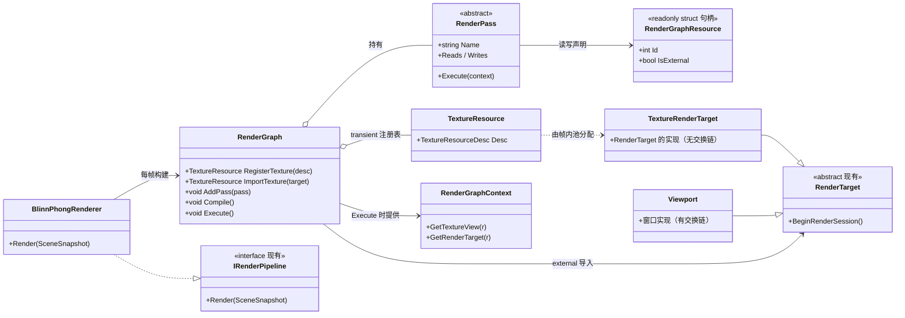

# Spark.Engine RenderGraph 设计

> 状态：已实现（Phase B 核心：声明依赖 + 拓扑排序 + 生命周期 + 简化剔除；别名复用与 barrier 未落地）。
> 本文描述帧图（RenderGraph / RDG）的目标架构、分阶段实施计划，以及 Phase B 落地后的实现结构与踩坑经验。
> 决策记录：见 §7；UE/Unity 对比：见 §8；未决事项：见 §9；实现落地与踩坑：见 §10。
> 关联代码：`Src/Spark.Engine/Render/RenderGraph/`（`RenderGraph.cs`、`RenderPass.cs`、`RenderPassBuilder.cs`、
> `RenderGraphContext.cs`、`RenderGraphResource.cs`、`TextureResource.cs`、`TextureResourceDesc.cs`、
> `ResourceAccess.cs`、`TransientResourcePool.cs`）、
> `Src/Spark.Engine/Render/Pipeline/BlinnPhong/BlinnPhongRenderer.cs`、
> `Src/Spark.Engine/Render/Pipeline/BlinnPhong/Stages/ShadowDepthStage.cs`、`BlinnPhongStage.cs`。

## 1. 背景与目标

当前渲染器是**单 pass 前向**：`BlinnPhongRenderer` 每个相机只有一个颜色 render pass（连深度缓冲都没有），
片元里 `shade_lit` 一次遍历所有光。多 pass 能力只推进到了 shader 侧——`ShaderPass`（Forward/ShadowDepth/
DepthOnly）已能按 pass 编出正确 WGSL（ADR-22），但**渲染器仍只画 `Forward`**。

一旦做阴影（步骤 B）或后处理，就会出现一类典型问题：

1. **临时资源生命周期手写**：阴影深度贴图、后处理中间图需要手动 create/release/池化，容易泄漏或复用错。
2. **pass 顺序脆弱**：当前依赖「填写顺序 = 渲染顺序」表达依赖（P2-6），无法重排/并行/剔除，改一下顺序就
   悄悄出 bug。
3. **无别名复用**：存活区间不重叠的临时纹理（如阴影贴图 vs HDR 中间图）无法共用物理内存，内存/带宽浪费。
4. **无 pass 剔除**：某个 pass 的产物本帧没人消费（如没有灯投影子），也不会自动跳过。
5. **barrier/状态转换手写**：深度附件 → 可采样之间的转换（WebGPU 上部分由 usage 校验兜底）需要人工保证。

目标：引入 **RenderGraph**——渲染代码只**声明**「每个 pass 读什么、写什么」，引擎从图推导出
**执行顺序、资源生命周期、别名复用、pass 剔除与状态转换**。概念源自 EA Frostbite 2017 论文
*FrameGraph: Extensible Rendering Architecture*，UE5（RDG）与 Unity SRP（Render Graph API）均已采用。

## 2. 设计原则（在 P1~P17 上新增）

- **P18 声明依赖、图推导执行**：pass 只声明读写资源；拓扑序、生命周期、别名、barrier 由图编译得出，
  「顺序」不再作为依赖的隐式表达。
- **P19 资源分 transient / external**：图内临时资源（transient）由图管理（分配/释放/别名），对外资源
  （external，如窗口 backbuffer、持久贴图）由外部导入、图只引用。
- **P20 编译与执行分离**：`Compile`（分析依赖/算生命周期/分配）与 `Execute`（录制命令/提交）分两阶段，
  便于缓存与调试。
- **P21 别名复用后置**：先只做「生命周期 + 依赖拓扑」，内存别名（aliasing）作为后续阶段——先正确，再优化。

## 3. 核心概念

```
RenderGraph（每帧）
 ├─ RegisterTexture(desc) → transient TextureResource
 ├─ ImportTexture(existing) → external TextureResource
 └─ AddPass(name, setup, execute)  ── setup 里声明读/写哪些资源
        │
        ▼ Compile()：建依赖边 → 拓扑排序 → 算每个 transient 资源的存活区间 → 分配/别名
        ▼ Execute()：按拓扑序执行 pass；帧末统一释放 transient 资源
```

### 3.1 RenderGraphResource / TextureResource

```csharp
// 图资源句柄（值类型，pass 间只传句柄，不传 GPU 对象）
public readonly struct RenderGraphResource
{
    public readonly int Id;                       // 图内唯一
    public readonly bool IsExternal;              // transient = 图管理，external = 外部导入
}

// 纹理资源描述（transient 资源据此在帧内池里分配 GPU 纹理）
public readonly struct TextureResourceDesc
{
    public readonly uint Width, Height;
    public readonly TextureFormat Format;         // 颜色或 Depth24Plus 等深度格式
    public readonly TextureUsage Usage;           // RenderAttachment | TextureBinding
}

// 一个 pass 对某资源的一次访问（编译时据此建依赖与 barrier）
public readonly struct ResourceAccess
{
    public readonly RenderGraphResource Resource;
    public readonly ResourceUsage Usage;          // Read / Write（Texture 细分：Sample / RenderTarget）
}
```

### 3.2 RenderPass

```csharp
// pass 是「声明 + 执行」的最小单元；执行回调拿到图解析出的真实资源视图
public abstract class RenderPass
{
    public string Name { get; }
    public ReadOnlySpan<RenderGraphResource> Reads { get; }
    public ReadOnlySpan<RenderGraphResource> Writes { get; }

    public abstract void Execute(RenderGraphContext context);
}

// 执行上下文：把图内句柄解析成真实 GPU 对象（RenderTarget / TextureView）
public readonly struct RenderGraphContext
{
    public TextureView* GetTextureView(RenderGraphResource r);
    public RenderTarget GetRenderTarget(RenderGraphResource r);
}
```

关键点：**pass 的代码里永远不直接拿 GPU 资源**，只拿 `RenderGraphResource` 句柄；`Execute` 时才经
`RenderGraphContext` 解析。这样图才能在编译期决定「谁先谁后、能否别名、要不要插 barrier」。

### 3.3 编译（Compile）要做的事

1. **建依赖边**：pass A 写 R、pass B 读 R → A→B 边；显式 `DependsOn` 补充不可见的顺序依赖。
2. **拓扑排序**：得执行序；有环则报错（检测循环依赖）。
3. **算存活区间**：每个 transient 资源的 first-write ~ last-read 区间。
4. **分配/别名**（P21 后置）：存活区间不重叠的 transient 纹理复用同一物理内存。
5. **剔除**：transient 资源无任何消费者 → 生产它的 pass 可被跳过（级联）。

## 4. 与现有抽象对接

这是本设计的关键——RDG 不推翻现有体系，而是**架在 `IRenderPipeline` / `RenderTarget` / `ShaderPass` 之上**：

| 现有抽象 | 在 RDG 里的角色 |
|---|---|
| `IRenderPipeline` | 管线实现内部每帧建一个 `RenderGraph`（或由 `BlinnPhongRenderer` 持有） |
| `RenderTarget`（抽象）/ `Viewport` | **external 资源**：窗口 backbuffer 导入图，作为最终 pass 的写目标 |
| `TextureRenderTarget`（已实现） | **transient 资源的 GPU 载体**：RDG 的前置依赖（阶段 A），已落地 |
| `RenderTargetSession` | 帧级 begin/end 语义：窗口=帧首 acquire / 帧末 present（各一次），贴图=绑定/留待采样 |
| `RenderTargetRegistry` | external 资源（持久贴图/窗口）的跨线程注册表，图只引用其 Id |
| `ShaderPass` | 图的 pass 与 shader pass 一一对应：ShadowDepth pass 取 `ShaderPass.ShadowDepth` 的 pipeline |
| `MaterialShaderCache.GetPipeline(key, pass, format)` | pass 执行时按 (材质 key, pass, 目标 format) 取 pipeline |
| 四层绑定组 | group0 帧 uniform 由 pass 级写入（相机/光照），group1~3 由 draw 级绑定 |

### 4.1 目标：阴影 + 前向两 pass（步骤 B 的 RDG 形态）

```
RenderGraph graph;

// 深度贴图：transient，本帧 shadow pass 写、forward pass 读
var shadowDepth = graph.RegisterTexture(new TextureResourceDesc {
    Width = 2048, Height = 2048, Format = Depth24Plus,
    Usage = RenderAttachment | TextureBinding });

// 窗口 backbuffer：external，forward 最终写它
var backbuffer = graph.ImportTexture(viewport);

graph.AddPass("ShadowDepth", reads: {mesh列表}, writes: {shadowDepth},
    ctx => { /* 用 ShaderPass.ShadowDepth 的 pipeline 把 CastShadow mesh 渲进 shadowDepth */ });

graph.AddPass("Forward", reads: {shadowDepth}, writes: {backbuffer},
    ctx => { /* group0 绑光源 + shadowDepth 采样，ShaderPass.Forward 渲进 backbuffer */ });

graph.Compile();   // shadowDepth 无消费者时跳过 ShadowDepth；算生命周期
graph.Execute();   // 按拓扑序跑；帧末释放 shadowDepth
```

没有 RDG 时，`shadowDepth` 的创建、两条 pass 的顺序、`shadowDepth` 的释放、以及「没有灯投影子就跳过」
全都得手写在 `BlinnPhongRenderer.Render` 里；有 RDG 后这些由编译期统一处理。

## 5. 核心类图



## 6. 分阶段计划

| 阶段 | 内容 | 验收标准 |
|---|---|---|
| **A TextureRenderTarget（前置）** | 离屏渲染目标（无交换链）：GPU 纹理 + 视图，`BeginRenderSession` 绑定附件、`EndRenderSession` 无 present；走 `RenderTargetRegistry` 与 ADR-7 | 相机能渲到贴图、贴图能被采样 |
| **B RenderGraph 核心** | `RenderGraph`/`RenderPass`/`RenderGraphResource`/`RenderGraphContext`；`RegisterTexture`/`ImportTexture`/`AddPass`；`Compile`（依赖边 + 拓扑排序 + 存活区间，**无别名**）；`Execute`（帧末释放 transient） | 阴影 + 前向两 pass 跑通；删一个 pass 的消费者能级联剔除 |
| **C 别名复用** | 存活区间不重叠的 transient 纹理共用物理内存（帧内纹理池） | 内存峰值 = 最大并发占用，而非总和 |
| **D barrier + 剔除** | WebGPU usage 校验之上显式表达状态转换；pass 级剔除 | 无花屏/黑屏；被剔除 pass 不分配资源 |
| **E 可视化/调试** | dump 图：pass 依赖、资源生命周期、读写边（✅ 只读 dump 已落地：`RenderGraph.Dump()` + `RenderGraphVisualizer` 输出 Mermaid/DOT/JSON；barrier 位置待 Phase D）；图形化**配置**（可编辑）待做 | 图形化排查多 pass 顺序 bug |

依赖：A → B → C/D → E。**B 是核心**（先「声明依赖、图推导顺序与生命周期」），C 别名与 D barrier 都是优化/正确性增强。

## 7. 决策记录（ADR，续 MaterialSystem-Design.md §12）

| ID | 决策 | 备选 | 理由 |
|---|---|---|---|
| ADR-23 | pass 只声明读写资源，依赖由「资源数据流」推导，不再靠「填写顺序」 | 显式 `DependsOn` 列表 / 命令式顺序 | 顺序是脆弱约定（P2-6）；数据依赖可重排/并行/剔除/自动 barrier |
| ADR-24 | 资源分 transient（图管理）与 external（外部导入） | 全部图管理 / 全部外部 | 窗口/持久贴图生命周期归外部，中间产物生命周期归图，边界清晰 |
| ADR-25 | 编译（Compile）与执行（Execute）分离 | 单阶段即时执行 | 便于缓存、拓扑排序、调试可视化；pass 代码与资源解析解耦 |
| ADR-26 | 别名复用后置（P21），先只做生命周期 + 拓扑 | 一步到位含别名 | 先正确再优化；别名引入的内存复用与调试复杂度不值得阻塞多 pass 落地 |
| ADR-27 | RDG 架在 `IRenderPipeline`/`RenderTarget`/`ShaderPass` 之上，不重写渲染器 | 独立于现有抽象的平行体系 | 复用 `RenderTarget` 会话语义、`ShaderPass` 变体、绑定组分层，改动面最小 |

## 8. 与 UE / Unity 对比

| Spark.Engine（本设计） | Unreal Engine | Unity SRP |
|---|---|---|
| `RenderGraph` | `FRDGBuilder` | `RenderGraph`（Render Graph API） |
| `RenderPass` | `FRDGPass` / `FSceneRenderer` 里各 pass | `ScriptableRenderPass` |
| `RenderGraphResource` 句柄 | `FRDGTexture` / `FRDGBuffer` | `TextureHandle` / `BufferHandle` |
| transient / external | 同（RDG 内置 lifetime + 外部 import） | 同（`CreateTransientTexture` / `ImportTexture`） |
| `TextureResourceDesc` | `FRDGTextureDesc` | `RenderTextureDescriptor` |
| `RenderGraphContext` | `FRDGPassBuilder` / `PassParameters` | `RenderGraphContext` |
| 编译：拓扑/存活/别名/barrier | RDG 全套 | 全套 |
| `TextureRenderTarget`（前置） | `UTextureRenderTarget2D` + `FRenderTarget` | `RenderTexture` / `RTHandle` |
| `Viewport` 作为 external | `FViewport` / backbuffer | `Camera.target` / backbuffer |

吸收的两条经验：

1. **先做生命周期与拓扑，别名后置**（Frostbite 原论文也是先立「图」，后加 alias）；UE/Unity 都是先有图、再逐步加内存复用。
2. **transient/external 二分是 RDG 的骨架**：几乎所有 RDG 实现（Frostbite/UE/Unity）都用这一刀切清「谁管资源生命周期」。

## 9. 未决事项 / 后续阶段

- **多相机 / 多视口**：✅ acquire/present 已收口到 `RenderGraph.Execute` 帧级（每帧 acquire/present 各一次，
  多相机写同一 backbuffer 共享同一帧，pass 经 `GetTextureView` 取视图）。仍待：分屏 / 一 surface 多视口时
  各 viewport 的图是独立还是合并、backbuffer import 边界（P3）。
- **buffer 资源**：当前只有纹理；Compute pass 需要 `GraphicsBuffer`/storage buffer 的 transient 版本（P18 需扩展到 buffer）。
- **别名复用（Phase C）**：存活区间不重叠的 transient 纹理共用物理内存（含移动端 tile-based GMEM 的 on-chip
  复用与主存别名两套）；当前 `TransientResourcePool` 已按描述跨帧复用物理纹理，但仍不做生命周期区间别名。
- **barrier 与 pass 级剔除（Phase D）**：当前剔除是简化版（仅「无消费者的纯 transient 写 pass」），
  `FirstWrite/LastRead` 对多 pass 读写的覆盖不完整。
- **异步 compute / 并行 pass**：图给出并行机会后，是否接入 WebGPU compute queue 重叠。
- **图编译缓存**：跨帧缓存拓扑与资源池，避免每帧全量重建（UE/Unity 都做了）。
- **图形化配置（可编辑节点图）**：✅ 基础已落地为**独立可选模块**——pass 类型注册表（`RenderPassType` /
  `RenderPassTypeRegistry`）+ 可序列化图定义（`RenderGraphDefinition`）+ 运行时装配器（`RenderGraphAssembler`）。
  运行时 `BlinnPhongRenderer` 仍命令式建图，不依赖该模块；未来编辑器以配置层为入口。仍待：编辑器 UI（读注册表
  拖线产定义 + JSON 持久化）。关键设计点：静态图中「有投影灯才加 ShadowDepth」这类动态条件现以运行时命令式分支
  表达，真·静态图需条件节点。

## 10. 实现落地与踩坑经验（Phase B，2026-08-17）

Phase B 已实现并跑通「ShadowDepth → BlinnPhong / SkeletalMesh → UIOverlay」多 pass（见 [ShadowMapping-Design.md](./ShadowMapping-Design.md)）。
实现与本文设计的两点差异：

- `RenderPass` 是**具体密封类**（`name + setup/execute 委托`），不是 §3.2 的抽象基类——更轻量，pass 不持有
  GPU 资源，资源在 `RenderGraphContext` 里按句柄解析。
- 生命周期区间别名（Phase C）与 barrier（Phase D）**未落地**；`TransientResourcePool` 当前按描述复用物理纹理，帧末归还空闲池，管线销毁时释放。

以下经验都源自 wgpu 的 draw-time validation 崩溃（报错点常是 `RenderPassEncoderEnd`，见
[ShadowMapping-Design.md §4.1](./ShadowMapping-Design.md#41-显式-pipelinelayout-的-bind-group-完整性)）：

1. **窗口 backbuffer 是 external 资源，acquire/present 收口到帧级**。`RenderGraph.Execute` 帧首对每个
   external `Viewport` 只 `BeginRenderSession()`（acquire）一次、帧末 dispose session（present）一次；
   pass 里经 `ctx.GetTextureView(backbuffer)` 取 acquire 的视图，`if (colorView == null) return;` 跳过
   acquire 失败（surface lost）的帧，颜色附件用 `colorView`。多相机/多 pass 写同一 backbuffer 时共享
   同一次 acquire/present，避免各自 acquire 造成的覆盖/交错与重复 present。
2. **transient 资源 + 缓存的 bind group = 悬垂视图**。阴影贴图虽然跨帧复用，但仍只在图执行期间保持有效；若 forward
   pass 的 group0 bind group 只建一次，第 2 帧起就引用已释放的旧视图（阴影永远停在第 1 帧且泄漏）。
   规则：**凡引用 transient 资源的 bind group，必须随该资源每帧重建**，或把该资源改为 persistent 而非 transient。
3. **bind group 必须「完整 + 类型正确」**。显式 `PipelineLayout` 声明了几个组，draw 前就要为管线实际用到的
   每个组 set 一个兼容 bind group（含 fallback）；且每个 binding 的资源类型要与布局一致——深度槽绑深度纹理、
   `SamplerBindingType.Comparison` 槽绑 `Compare≠Undefined` 的比较采样器，不能用颜色纹理/过滤采样器顶替。
4. **帧级 bind group 按「有无阴影」分流**：有阴影用含阴影贴图的 group0，无阴影用含 1×1 占位深度纹理的
   group0，避免 set 一个 null bind group。
5. **排查顺序**：把日志里的 `index N` 映射到固定组职责（group0 帧 / group1 对象 / group2 材质参数 / group3
   材质纹理）→ 比对 `DeviceCreatePipelineLayout`、`DeviceCreateBindGroup`、draw 前 `SetBindGroup` 三处的
   布局对象与索引 → 检查 bind group 是否被提前释放。仅 build 通过不能覆盖 draw-time validation。

---

### 与现有文档的关系

- 本文承接 [README](./README.md) 二、P2-6「帧内渲染依赖 / 拓扑排序」，把它展开为 RDG 的目标架构。
- 前置依赖 `TextureRenderTarget` 对应 [RenderPipeline-Design.md](./RenderPipeline-Design.md) §14 的
  `TextureRenderTarget` 未决项；pass 语义对应 [MaterialSystem-Design.md](./MaterialSystem-Design.md) §7.1 的
  `ShaderPass`（ADR-22）。
- 不推翻 [SceneSync-Design.md](./SceneSync-Design.md) 的单通道同步：`SceneSnapshot` 仍是渲染器的输入，
  RDG 只接管「快照之后、提交之前」的绘制编排。
