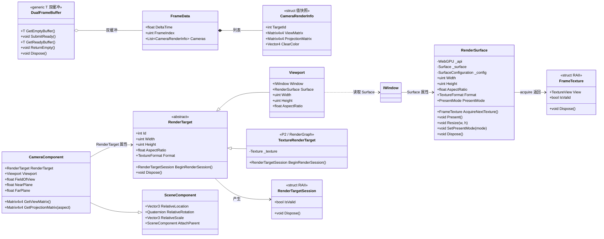
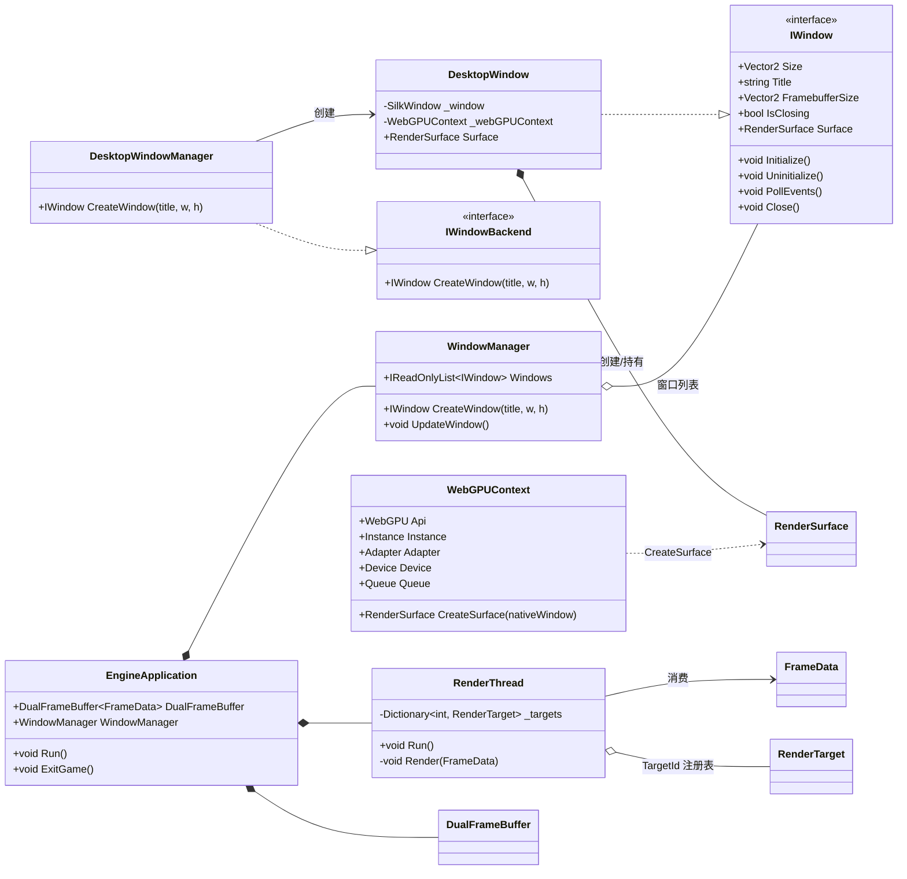

# Spark.Engine 渲染管线与渲染目标设计

> 状态：设计定稿（未实现）
> 决策记录：见 §12；UE 对比：见 §13；未决事项：见 §14
> 关联代码：`Src/Spark.Engine/Render/*`、`Src/Spark.Engine/Platforms/*`、`Src/Spark.Engine.Desktop/*`

## 1. 背景与目标

当前引擎处于早期原型阶段：窗口系统（Silk.NET.Windowing）与 WebGPU（Silk.NET.WebGPU）已打通，
但渲染管线为空壳——`RenderThread.Render` 是空方法、`FrameData` 是空类、`Viewport` 只是一个
"窗口 + 表面指针 + 相机槽"的绑定器，与帧循环零连接。

本设计要解决的三个核心问题：

1. **Surface 裸指针暴露**：`IWindow.Surface` / `Viewport.Surface` 直接暴露 `Surface*`，无生命周期
   状态、unsafe 泄漏到 API 表面、无法自愈、不可测试。
2. **Surface resize 缺失**：交换链只在窗口 `Initialize` 时配置一次，缩放后不重配；且用的是
   逻辑像素 `_window.Size`，HiDPI 下尺寸本身错误。
3. **逻辑线程与渲染线程之间的帧数据通路为空**：`FrameData` 需要设计为"值快照 + 资源 ID"，
   承载本帧活跃相机的值快照（含目标 ID）。帧由相机驱动：逻辑线程遍历活跃相机，渲染
   线程按相机绑定的目标分派渲染。

目标架构：**渲染目标统一抽象为 `RenderTarget`——`Viewport` 是其窗口实现（持有
`RenderSurface`，唯一带交换链的一种），离屏贴图输出用 `TextureRenderTarget`**；交换链脏活
封装进 `RenderSurface`（渲染线程独占）；帧数据只传值快照与资源 ID，绝不跨线程传指针。

## 2. 设计原则

- **P1 裸指针不出引擎核心库**：`Surface*` 等原生句柄只存在于 `RenderSurface` 内部（以及极少数
  渲染线程内部点），对外只暴露封装类型 `RenderSurface` / `FrameTexture`。
- **P2 资源线程归属唯一**：GPU 资源（surface、纹理、管线、渲染目标）归渲染线程所有，逻辑线程
  通过**资源 ID + 注册表** 间接引用，永不直接持有。
- **P3 帧数据一致性**：逻辑线程与渲染线程之间用 `DualFrameBuffer` 双缓冲（最多超前 1 帧），
  跨线程对象一律**值快照**，渲染线程读到的永远是一帧完整一致的数据。
- **P4 懒重配**：surface 尺寸 / PresentMode / lost 变化一律在 acquire 前检查并重配，不做事件驱动
  （事件版留到 P1，见 §12 ADR-2）。
- **P5 所有权单向**：平台层创建/销毁 `RenderSurface`，渲染系统只引用使用。
- **P6 渲染目标统一**：相机输出目标不限于窗口——离屏贴图（后处理/阴影/小地图）用同一个
  `RenderTarget` 抽象与同一条帧数据通路，`Viewport` 只是窗口目标的特例（见 §8 ADR-6）。

## 3. 总体架构与数据流

```
┌───────────────────── 主线程（逻辑） ─────────────────────┐
│ EngineApplication.Run                                  │
│  ├─ WindowManager.UpdateWindow()  窗口事件/增删         │
│  ├─ EngineSynchronizationContext.Update()  async 回调   │
│  ├─ OnUpdate(dt) → World.Update(dt) → Actor.Update(dt)  │
│  └─ 遍历活跃相机 → 填写 FrameData（相机值快照 + 目标ID）│
│            │ SubmitReady()                              │
└────────────┼────────────────────────────────────────────┘
             ▼ DualFrameBuffer<FrameData>（双缓冲，超前≤1帧）
┌───────────────────── 渲染线程 ──────────────────────────┐
│ RenderThread.Run                                      │
│  ├─ GetReadyBuffer() → FrameData                       │
│  ├─ 遍历 Cameras，按 TargetId 分组                     │
│  │    ├─ TargetId → RenderTarget 注册表                │
│  │    ├─ BeginRenderSession()：窗口=acquire，贴图=绑定  │
│  │    ├─ 清屏（仅组内第一个相机，ClearColor）           │
│  │    ├─ 依次用各相机 ViewMatrix/ProjectionMatrix 快照   │
│  │    │     渲染场景（叠加）                           │
│  │    └─ EndRenderSession()：窗口=present，贴图=无操作  │
│  └─ ReturnEmpty()                                      │
└─────────────────────────────────────────────────────────┘
```

依赖拓扑：

```
A. RenderSurface 封装（无依赖，最先做）
   ↓
B. IWindow / WebGPUContext / DesktopWindow 改造（依赖 A）
   ↓
C. RenderTarget 抽象 + Viewport 改造（依赖 B 的类型）
   ↓
D. FrameData 设计（依赖 C 的 API 形状）
   ↓
E. RenderThread 接入（依赖 C + D）
   ↓
F. WindowManager / EngineApplication 生命周期接线 + 验证
```

### 3.1 核心类图（帧数据与渲染目标）



### 3.2 类图（平台与引擎集成）



> 说明：图中 `Surface` / `Instance` / `Adapter` / `Device` / `Queue` / `Texture` / `TextureView`
> 均为 Silk.NET.WebGPU 原生指针类型（unsafe），按设计原则 P1 只存在于 `RenderSurface` /
> `WebGPUContext` 等封装内部，不进入 FrameData 与公共 API。

## 4. Surface 封装：`RenderSurface`

新建 `Src/Spark.Engine/Render/RenderSurface.cs`（核心库，不依赖平台层）。

### 4.1 职责

- 持有原生 `Surface*` 与 `SurfaceConfiguration`，封装整个交换链生命周期；
- 提供 acquire / present 成对操作（渲染线程独占）；
- 懒重配：尺寸 / PresentMode / surface lost 变化时自动重新配置；
- 对外只暴露只读状态与操作，裸指针永不外泄。

### 4.2 状态机

```
Created ──(首次 EnsureConfigured 成功)──▶ Configured ──(Dispose)──▶ Disposed
   │                                          │
   └────(Dispose)────▶ Disposed ◀─────────────┘
```

- `Created`：surface 已创建但未配置；调用 acquire/present 抛明确异常。
- `Configured`：交换链有效；acquire/present 可调用；检测到尺寸/PresentMode/lost 变化时
  在 acquire 前自动重配（状态不变，只是重新 `SurfaceConfigure`）。
- `Disposed`：任何操作抛 `ObjectDisposedException`。

### 4.3 公开 API（草案）

```csharp
public unsafe sealed class RenderSurface : IDisposable
{
    // 原生句柄全部私有：WebGPU _api、Adapter* _adapter、Surface* _surface、SurfaceConfiguration _config

    // 对外只读状态（相机投影要用）
    public uint Width { get; }               // 物理像素
    public uint Height { get; }
    public float AspectRatio => Width / (float)Height;
    public TextureFormat Format { get; }
    public PresentMode PresentMode { get; }

    // 渲染线程独占
    public FrameTexture AcquireNextTexture();   // 内部 EnsureConfigured + SurfaceGetCurrentTexture
    public void Present();                      // SurfacePresent

    // 配置变更（内部仅标记 dirty，实际重配在下次 acquire）
    public void Resize(uint width, uint height);
    public void SetPresentMode(PresentMode mode);

    public void Dispose();                      // SurfaceUnconfigure + 释放
}
```

### 4.4 懒重配机制（`EnsureConfigured`）

每次 `AcquireNextTexture` 前调用，判定任一条件成立则重新配置：

1. 记录的配置尺寸 ≠ 当前目标尺寸（窗口 `FramebufferSize`，物理像素）；
2. `PresentMode` 目标值 ≠ 当前值（PresentMode 变更需重建交换链）；
3. 检测到 surface lost（`SurfaceGetCurrentTexture` 失败或 `SurfaceLost` 状态）。

重配流程：`SurfaceGetCapabilities` → 构造 `SurfaceConfiguration` → `SurfaceConfigure` → 更新
记录的 Width/Height/Format/PresentMode。**失败不崩溃**：记录错误并标记失效，由调用方决定跳过
本帧（见 §9）。

> 尺寸来源约定：物理像素一律取窗口 `FramebufferSize`（Silk.NET `IWindow.FramebufferSize`），
> 不是 `Size`（逻辑像素）。这是对现状 HiDPI bug 的修复。

### 4.5 `FrameTexture`（轻量 acquire 结果）

```csharp
public readonly unsafe struct FrameTexture : IDisposable
{
    public TextureView* View { get; }   // 仅渲染线程内部使用
    public bool IsValid { get; }
    public void Dispose();              // present 后即失效，防止误用
}
```

RAII 语义：acquire 返回、present 后失效。裸指针仅允许渲染线程内部流转，不进入 FrameData。

## 5. 平台层改造

| 文件 | 现在 | 改为 |
|---|---|---|
| `IWindow.cs` | `Surface* Surface { get; }` + `using Silk.NET.WebGPU;` | `RenderSurface? Surface { get; }`；删除 WebGPU using（接口不再 unsafe）；新增 `FramebufferSize`（物理像素） |
| `WebGPUContext.cs` | `CreateSurface` 返回 `Surface*` | 返回 `RenderSurface`（创建 + 初始配置搬进封装） |
| `DesktopWindow.cs` | 手写 `ConfigureSurface()`，用 `_window.Size` | `Initialize` 时创建 `RenderSurface`；`Uninitialize` 时 `Surface.Dispose()`；尺寸用 `_window.FramebufferSize` |
| `Viewport.cs` | 拷贝缓存 `_surface` | `Surface => Window.Surface` 实时取值，删缓存（修悬垂指针） |

所有权：`RenderSurface` 由平台后端（`DesktopWindow`）在 `Initialize` 时创建、`Uninitialize` 时销毁；
渲染系统（Viewport/RenderThread）只引用使用。核心库 `Spark.Engine` 是唯一的 WebGPU 依赖点。

## 6. 窗口 Surface Resize

**机制：每帧懒重配（ADR-2）。** 不引入 resize 事件，避免主线程 → 渲染线程的同步复杂度。

- `RenderSurface.EnsureConfigured` 在每次 acquire 前比对 `FramebufferSize`，变化即重配；
- 重配后 `RenderSurface.Width/Height` 更新 → Viewport 尺寸/宽高比随之更新 → 下一帧相机投影
  aspect 用新值（投影矩阵由逻辑线程在填写 FrameData 时计算，天然拿到最新 aspect）。

P1 可选增强：`FramebufferResize` 事件版（主线程收事件 → `EngineSynchronizationContext` 通知
渲染线程），用于需要即时响应（而非下一帧）的场景。当前不需要。

## 7. FrameData 设计

### 7.1 数据通路现状

`DualFrameBuffer<FrameData>`（单生产者/单消费者双缓冲）已就绪：

- 逻辑线程：`GetEmptyBuffer()` → 填写 → `SubmitReady()`
- 渲染线程：`GetReadyBuffer()` → 渲染 → `ReturnEmpty()`
- 双缓冲保证逻辑线程最多超前 1 帧，buffer 复用安全（逻辑线程拿到的空 buffer 必然已被渲染
  线程消费完）。

### 7.2 设计决策：值快照 + 资源 ID（ADR-1）

**FrameData 只放值类型快照与资源 ID，绝不携带 GPU/native 指针或跨线程对象引用。**

**帧由相机驱动（ADR-1）**：逻辑线程遍历"活跃相机"（场景里所有绑定了渲染目标的
`CameraComponent`），每个相机携带其目标 ID，渲染线程按目标分组渲染。相比按视口（目标）
组织帧（UE 的 `UGameViewportClient` 模式，见 §13），相机驱动更扁平、语义更自然（相机是
场景对象），且天然支持多个相机叠加渲染到同一目标（分组内顺序渲染、只 clear 一次）。

- 逻辑线程写 buffer A 时渲染线程可能还在读（双缓冲最多超前 1 帧），值快照保证渲染线程读到
  完整一致的一帧，不会读到逻辑线程正在修改的相机中间态；
- GPU 资源（surface、纹理等）归渲染线程所有，逻辑线程通过 `TargetId` 间接引用，渲染线程经自己
  的注册表解析为 `RenderTarget`（窗口视口或离屏贴图）——彻底杜绝跨线程裸指针（handle 模式，
  主流引擎做法）；
- 网格/材质等 GPU 资源走渲染线程资源注册表，不进 FrameData（RenderGraph/命令列表留到后续阶段）。

### 7.3 类型定义（草案）

```csharp
// Src/Spark.Engine/Render/FrameData.cs
public sealed class FrameData
{
    public float DeltaTime;                    // 逻辑帧耗时
    public uint FrameIndex;                    // 帧序号（调试/统计）
    public List<CameraRenderInfo> Cameras;     // 活跃相机快照，按渲染顺序排列（每帧 Clear 后复用）
}

public readonly struct CameraRenderInfo
{
    public int TargetId;                       // 该相机渲染到的目标 ID（窗口视口或离屏贴图）→ 渲染线程注册表
    public Matrix4x4 ViewMatrix;               // 值快照：逻辑线程算好
    public Matrix4x4 ProjectionMatrix;         // 值快照：FOV/aspect/near/far 已代入
    public Vector4 ClearColor;                 // 清屏色；仅当该目标组内第一个相机时生效
}
```

说明：

- **不携带 Width/Height**：渲染目标尺寸由渲染线程从 `RenderTarget` 注册表获取，FrameData 不冗余；
- **同目标多相机**：逻辑线程按渲染顺序填写（先画的在前），渲染线程分组处理（见 §9），组内第一
  个相机负责 clear，其余相机只叠加绘制；
- **目标统一为 `RenderTarget`**：相机输出不限于窗口——离屏贴图（后处理中间缓冲 / 阴影贴图 /
  小地图 / 编辑器预览）走同一结构，`Viewport` 只是窗口目标（见 §8）；
- **相机来源**：活跃相机列表由 `World.CollectCameras` 收集——遍历 Actor 拥有的
  `CameraComponent`，过滤出绑定了 `RenderTarget` 的相机（已随 World 接入主循环实现）。

### 7.4 线程安全分析

- buffer 复用：双缓冲语义下逻辑线程 `GetEmptyBuffer` 只会拿到已消费完的 buffer（超前 ≥2 帧时
  阻塞），安全；但**每帧必须 `Cameras.Clear()` 再填**，防止残留上一帧数据。
- 相机对象：逻辑线程计算 `ViewMatrix/ProjectionMatrix` 快照后，渲染线程不再触碰
  `CameraComponent` 对象本身——对象可在主线程自由销毁，不影响渲染线程。
- 资源 ID 稳定性：`TargetId` 由逻辑线程侧的目标注册表分配，渲染线程注册表同序映射；
  目标销毁时两侧同步摘除（见 §10），渲染线程对未知 ID 直接跳过该条目。

### 7.5 CameraComponent 扩展

```csharp
public class CameraComponent : SceneComponent
{
    public RenderTarget? RenderTarget { get; set; }     // 可写：相机渲染到哪个目标（帧收集的依据）
    public Viewport? Viewport => RenderTarget as Viewport;  // 便捷访问（仅当目标是窗口时非空）
    public float FieldOfView { get; set; } = 60f;  // 度
    public float NearPlane { get; set; } = 0.1f;
    public float FarPlane { get; set; } = 1000f;

    public Matrix4x4 GetViewMatrix();              // 由 WorldTransform 推导
    public Matrix4x4 GetProjectionMatrix(float aspect);  // CreatePerspectiveFieldOfView
}
```

## 8. 渲染目标抽象：`RenderTarget`（Viewport 只是窗口实现）

**最终关系（Viewport ↔ 相机）——完全解耦、单向引用**：

- 相机通过可写的 `RenderTarget` 属性**单向指向**目标（`Viewport` 或 `TextureRenderTarget`）；
  Viewport **不持有、不感知任何相机**；
- 帧由**相机驱动**：绑定了目标的相机进入 FrameData，渲染线程按目标分组执行；
- "某目标有哪些相机"是**纯推导关系**（`Camera.RenderTarget == this`），不是状态；
- 一个相机同一时刻只属于一个目标；一个目标可有多个相机（叠加渲染，组内第一个 clear）；
- 窗口关闭 → 目标失效 → 相机 `RenderTarget` 置空；目标无相机 → 不出现在 FrameData。

**回答"相机输出到贴图还需要 Viewport 吗"：不需要。** 贴图输出没有交换链，不需要
`RenderSurface` / acquire / present，需要的是等价的**渲染目标**抽象——`Viewport` 只是它
的**窗口实现**（唯一带 swapchain 的一种）。相机绑定目标统一为 `RenderTarget`：

- 渲染到窗口 → `Viewport`（acquire → 画 → present）
- 渲染到贴图（后处理中间缓冲 / 阴影贴图 / 小地图 / 编辑器预览）→ `TextureRenderTarget`
  （begin pass → 画 → end pass，无 present）

```csharp
// Src/Spark.Engine/Render/RenderTarget.cs
public abstract class RenderTarget : IDisposable
{
    public int Id { get; }                        // 注册表 ID（TargetId → 目标）
    public uint Width { get; }
    public uint Height { get; }
    public float AspectRatio => Width / (float)Height;
    public abstract TextureFormat Format { get; }

    // 渲染线程独占：渲染会话（一组相机画完才结束）
    public abstract RenderTargetSession BeginRenderSession();
    public abstract void Dispose();
}

// 窗口渲染目标（原 Viewport 角色）—— 唯一带交换链的实现
public sealed class Viewport : RenderTarget
{
    public IWindow Window { get; }                 // 构造绑定，不可换
    public RenderSurface? Surface => Window.Surface;  // 实时取值，不缓存（修悬垂指针）
    // Width/Height/AspectRatio 从 Surface 派生（物理像素）
    // BeginRenderSession → Surface.AcquireNextTexture()；EndRenderSession → Surface.Present()
}

// 离屏渲染目标（贴图输出，P2/RenderGraph 阶段实现）
public sealed class TextureRenderTarget : RenderTarget
{
    // 内部：渲染线程创建的 GPU 纹理 + 纹理视图（无 swapchain）
    // BeginRenderSession → 绑定纹理作为渲染附件；EndRenderSession → 无操作（纹理留待后续 pass 采样）
}
```

`RenderTargetSession`：渲染会话句柄（RAII）。窗口目标内部持 acquire 的 `FrameTexture`，
`Dispose` 时 present；贴图目标为空会话。

```csharp
public readonly struct RenderTargetSession : IDisposable
{
    public bool IsValid { get; }   // 窗口目标：acquire 失败（surface lost）时为 false
    public void Dispose();         // 窗口目标 = Present；贴图目标 = 无操作
}
```

要点：

- Viewport 退化为**纯渲染目标描述**：窗口 + 表面 + 尺寸。**不持有相机**——相机归属由
  `CameraComponent.RenderTarget`（可写）决定，帧由相机驱动（§7）；
- "某目标当前有哪些相机" = 所有 `Camera.RenderTarget == this` 的相机（P2 提供查询方法）；
- 一个目标可被多个相机渲染（叠加：先填的先画）；无相机绑定的窗口视口不会出现在 FrameData 中，
  渲染线程不 acquire/present（P2 起可显示棋盘格背景等占位内容）；
- 离屏目标同样注册在渲染线程注册表（`Dictionary<int, RenderTarget>`），逻辑线程经 ID 请求
  创建/销毁（渲染线程侧资源管理器，P2）；
- P2：`ViewportRect`（归一化 0..1）+ RenderPass 的 Viewport/Scissor 状态，支持一个 surface 渲
  多个子视口（分屏 / 编辑器多视图）。当前不做，避免过度设计。

## 9. RenderThread 渲染循环

```csharp
private void Render(FrameData frame)
{
    if (frame == null) return;

    // 按目标分组：同一目标一帧只 begin/end 一次，clear 只做一次
    foreach (var group in frame.Cameras.GroupBy(c => c.TargetId))
    {
        if (!_targets.TryGetValue(group.Key, out var target))
            continue;                          // 未知 ID：目标已销毁，跳过

        try
        {
            using var session = target.BeginRenderSession();
            if (!session.IsValid) continue;    // 窗口目标 surface lost / 重配失败：跳过本帧

            bool first = true;
            foreach (var cam in group)         // 保持逻辑线程填写顺序（叠加）
            {
                if (first)
                {
                    清屏(cam.ClearColor);      // 仅组内第一个相机
                    first = false;
                }
                // 用 cam.ViewMatrix / cam.ProjectionMatrix 渲染场景（当前为空）
                // ...渲染命令留到 RenderGraph 阶段...
            }
            // using 结束 → EndRenderSession：窗口 = Present；贴图 = 无操作
        }
        catch (Exception ex)
        {
            _logger.LogError(ex, "Render target {TargetId} failed", group.Key);
            // 不崩溃：窗口 surface 标记失效，下次 acquire 自愈
        }
    }
}
```

- 渲染线程维护 `Dictionary<int, RenderTarget> _targets` 注册表（窗口视口与离屏贴图统一登记）；
- 无目标/无相机时直接 `ReturnEmpty`（窗口目标不 acquire/present）；
- 窗口目标 acquire/present 异常（surface lost）不崩溃：标记重配、跳过该帧继续（配合 §4.4 自愈）；
- `GroupBy` 保持组首次出现顺序与组内顺序（LINQ 语义），叠加顺序 = 逻辑线程填写顺序。

## 10. 生命周期接线

- `WindowManager.CreateWindow` 成功后同步创建对应 `Viewport`；主窗口在 `EngineApplication` 构造
  时即有，后续窗口在 `UpdateWindow` 延迟初始化后补建；
- 窗口关闭/移除（`UpdateWindow` 的 pendingRemove 流程）→ 对应 Viewport 失效：从渲染线程注册表
  摘除（经 `EngineSynchronizationContext` 封送，渲染侧入 ADR-7 延迟删除队列）、解除相机绑定
  （相机 `RenderTarget` 置空）；
- `TextureRenderTarget` 由渲染线程侧的资源管理器创建/销毁（逻辑线程经 ID 请求，P2/RenderGraph）；
- `EngineApplication` 构造函数副作用（ctor 里 `CreateWindow`）低优先级顺手项：可移到 `Run()`，
  但不阻塞本设计。

## 11. 实施顺序与验收

| 阶段 | 内容 | 验收标准 |
|---|---|---|
| A | `RenderSurface` + `FrameTexture`（含懒重配/状态机/acquire/present） | 状态机单元测试（dirty 判定抽纯函数可测） |
| B | `IWindow`/`WebGPUContext`/`DesktopWindow` 改返回 `RenderSurface`，用 `FramebufferSize` | 核心库无 `Surface*` 暴露；编译通过 |
| C | `RenderTarget` 抽象 + `Viewport` 窗口实现（去裸指针、尺寸派生）；`CameraComponent.RenderTarget` 可写 | 无 unsafe 指针成员、无相机持有；相机可绑定任意目标类型 |
| D | `FrameData` 值快照（`TargetId`）+ `CameraComponent` 投影参数 | 结构就绪，逻辑线程填写通路接上 |
| E | `RenderThread` 分组循环 + `RenderTarget` 注册表（窗口目标 acquire→clear→present） | Demo 跑起来持续清屏呈现 |
| F | WindowManager/EngineApplication 生命周期接线 | resize 窗口不撕裂不崩溃；关窗正常退出 |

## 12. 决策记录（ADR）

| ID | 决策 | 备选 | 理由 |
|---|---|---|---|
| ADR-1 | FrameData 用值快照 + 资源 ID，帧由相机驱动（遍历活跃相机，按目标分组渲染） | 直接引用场景对象；按视口（目标）组织帧 | 跨线程一致性与指针安全；handle 模式；相机是场景对象，语义自然，天然支持多相机叠加 |
| ADR-2 | Surface resize 用每帧懒重配 | 事件驱动重配 | 简单可靠、无线程跳转；事件版 P1 按需再加 |
| ADR-3 | 裸指针不出核心库，封装为 `RenderSurface` | 直接暴露 `Surface*` | 生命周期状态、unsafe 隔离、可测试、可换后端 |
| ADR-4 | 尺寸一律用物理像素 `FramebufferSize` | 逻辑像素 `Size` | HiDPI 正确性 |
| ADR-5 | `RenderSurface` 由平台层创建/销毁，渲染系统只引用 | 渲染系统自建 | 平台抽象与渲染系统各守其责 |
| ADR-6 | 渲染目标统一为 `RenderTarget` 抽象：`Viewport` 是窗口实现（有交换链），贴图输出用 `TextureRenderTarget` | 相机目标仅限窗口视口 | 离屏渲染（后处理/阴影/小地图）与窗口渲染共用同一帧数据通路与注册表，无重复机制 |
| ADR-7 | 渲染资源销毁走渲染线程延迟删除队列（跨线程标记，渲染线程空闲批量释放） | 直接 Dispose / 一次性封送 | handle 模式的标准配套；避免渲染线程读已释放资源（借鉴 UE 的 FRHIResource 延迟删除） |

## 13. 与 Unreal Engine 的对比与借鉴

对照（详见会话记录）：我们的 `RenderTarget` ≈ UE `FRenderTarget`（`FViewport` 窗口实现 /
`FTextureRenderTargetResource` 贴图实现）；`RenderSurface` ≈ `FViewportRHI`/`FRHIViewport`；
`FrameData.CameraRenderInfo` 值快照 ≈ `FSceneView`（GameThread 构造 → 渲染线程消费）；
双线程 ≈ UE 三线程（Game/Render/RHI）的简化；§14 RenderGraph ≈ UE5 `FRDGBuilder` 依赖图。

骨架同构，差异均为合理的早期简化（双线程二合一、懒重配、快照+循环代替命令流）。
由此吸收两条：

1. **延迟删除队列（ADR-7）**：资源销毁跨线程安全化的正式机制；
2. **场景捕获的显式开销语义**：UE 用独立组件（`USceneCaptureComponent2D`）而非相机改目标，
   因为捕获 = 每帧多一次完整场景渲染。我们的 `CameraComponent.RenderTarget` 更通用，但做
   后处理/阴影时需支持"专用目标 + 低捕获频率"的显式控制。

另一确认点：Present 回压闭环已隐式成立——present 慢 → acquire 阻塞 → `SubmitReady` 阻塞 →
逻辑线程降速（对应 UE5.5 低延迟帧同步的目标），无需额外机制。

## 14. 未决事项 / 后续阶段

- `TextureRenderTarget` 具体实现（GPU 纹理创建、pass 附件绑定，RenderGraph 阶段）；
- 帧内渲染依赖（后处理链：相机 A 渲到贴图 → 相机 B 采样；阴影贴图同理）——当前只保证
  "填写顺序 = 渲染顺序"，拓扑排序留到 RenderGraph 阶段；
- 资源销毁延迟删除队列（ADR-7 落地：跨线程标记 + 渲染线程空闲批量释放）；
- 网格、材质、管线状态对象与资源注册表（RenderGraph 阶段）；
- 渲染命令列表（现在 FrameData 只有清屏 + 相机快照，无 draw call）；
- 无相机视口的占位渲染（棋盘格背景等，编辑器场景视图需要）；
- `ViewportRect` 多视口（分屏 / 编辑器多视图）；
- PresentMode 由 `EngineOptions` 暴露（可切 VSync）；
- surface lost 的完整恢复策略（当前策略：跳过本帧 + 下次 acquire 重配）。
