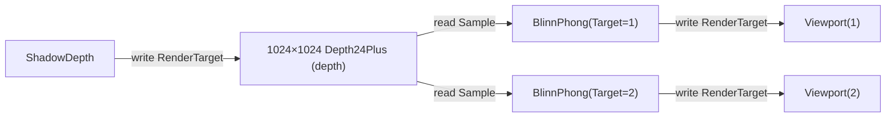

# 任务工作记录（Worklog）

> 记录「RenderGraph 可视化与图形化配置」两阶段：
> ① 编译后图结构 dump（只读可视化）；② pass 类型注册表 + 可序列化图定义 + 运行时装配器（图形化配置基础）。
> 对应 [RenderGraph-Design.md §6 阶段 E](../RenderGraph-Design.md) 的「可视化/调试」项。

## 概述

先给 RenderGraph 增加「编译后导出图结构为纯数据快照」的能力（Mermaid / DOT / JSON，接入运行时首帧日志），
再实现「pass 类型注册表 + 可序列化图定义 + 运行时装配器」作为**独立可选模块**（曾端到端验证，后与运行时
解耦——运行时仍走命令式建图，不依赖编辑器侧引脚/定义）。编辑器 UI 仍待后续。

## 落地内容

- **`RenderGraphDescription`**（新增 `Render/RenderGraph/RenderGraphDescription.cs`）：纯数据快照模型——
  `RenderGraphDescription`（pass 列表 + 资源列表）、`GraphPass`（名称/拓扑序/是否剔除/读写边）、
  `GraphResource`（Id/是否 external/标签/存活区间）、`GraphEdge`（资源 Id + 访问类型）。不携带 GPU 对象或委托，
  可序列化、可跨线程。
- **`RenderGraph.Dump()`**（`RenderGraph.cs` 新增）：`Compile()` 后把 `_resources`（按 Id 升序）与 `_passes`
  （注册序）导出为 `RenderGraphDescription`；external 资源存活区间记为 -1（无帧内生命周期）。
- **`RenderGraphVisualizer`**（新增 `RenderGraphVisualizer.cs`）：
  - `ToMermaid`：pass 与资源均为节点、读写为带标签的边（可粘贴进 Markdown / mermaid.live）；
  - `ToDot`：Graphviz digraph（资源椭圆 / pass 方框）；
  - `ToJson`：`System.Text.Json` 序列化（枚举转字符串、缩进）。
- **首帧 dump 接入**（`BlinnPhongRenderer.Render`）：编译后仅首帧把 Mermaid 打到日志（`_graphDumped` 防刷屏），
  便于可视化排查 pass 依赖与资源流向。

## 示例输出（当前 Demo：双窗口 + 投影阴影）

## 阶段 2：图形化配置基础（pass 类型注册表 + 定义 + 装配器）

- **`RenderPassType`**（`RenderPassType.cs`）：pass 类型 = 名称 + 输入/输出引脚（`RenderPassPin`）+
  参数 schema（`RenderPassParameter`）+ bind 委托（把「节点实例 + 已解析资源」装进 `RenderGraph`）。引脚/参数
  是编辑器面板元数据；GPU 执行代码在 bind 闭包里。
- **`RenderPassTypeRegistry`**：名称 → 类型的注册表（编辑器节点面板的发现来源）。
- **`RenderGraphDefinition`**（`RenderGraphDefinition.cs`）：可序列化的图定义——`ResourceDeclaration`
  （transient 宽高/格式/用途 或 external 目标 Id）+ `NodeDeclaration`（类型 + 引脚连线 + 参数覆写）；
  `RenderGraphDefinitionSerializer` 提供 JSON 读写（camelCase + 枚举字符串）。
- **`RenderGraphFrameContext`**：帧级动态输入（WebGPU 上下文 / 场景快照 / 目标注册表 / 日志），不进静态定义。
- **`RenderGraphAssembler`**：注册/导入资源 → 按节点类型解析引脚并校验 → 调类型 bind；产出可 Compile/Execute 的图。
- **`ShadowDepthPass`**：验证期间临时改为 `AddPass`（只加 pass，资源由装配器注册）；解耦后改回 `AddToGraph`
  （自注册 + 加 pass）。
- **`BlinnPhongRenderer`**：验证期间临时改走 `BuildDefinition()` → `RenderGraphAssembler.Assemble`，确认装配
  路径与命令式等价（画面 + Mermaid 日志正确）；随后**解耦**——`Render()` 回到命令式建图
  （register/import/addpass），不依赖引脚/定义/装配器。配置层保留为独立模块，未来编辑器直接作为入口。

## 遗留待办

- **编辑器 UI**：读 `RenderPassTypeRegistry` 生成节点面板 → 拖线产 `RenderGraphDefinition` → JSON 持久化；落地时
  让配置层作为编辑器入口（当前独立、未被运行时引用）。
- **静态图动态条件建模**：现在「有投影灯才加 ShadowDepth」在运行时是命令式代码分支；真·静态图需可空连接/条件节点。
- **barrier 位置可视化**：依赖 Phase D 的 barrier 表达落地后才能 dump barrier 边。
- **运行时验证**：装配路径已本地跑通（画面 + Mermaid 日志正确）；JSON 往返与解耦后的命令式路径仍建议本地再确认。
